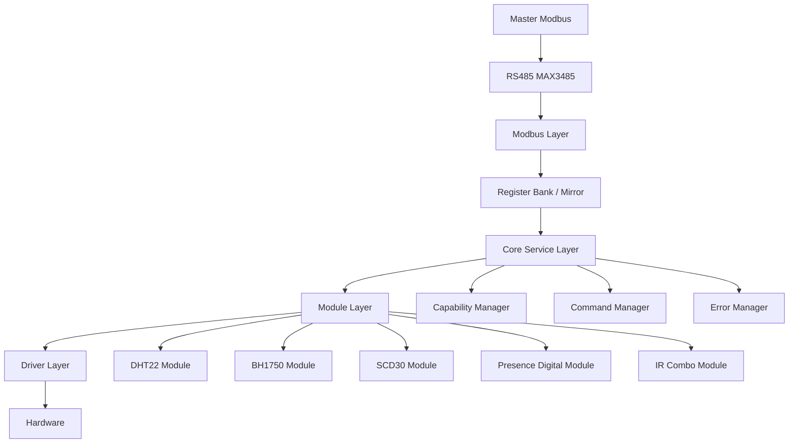
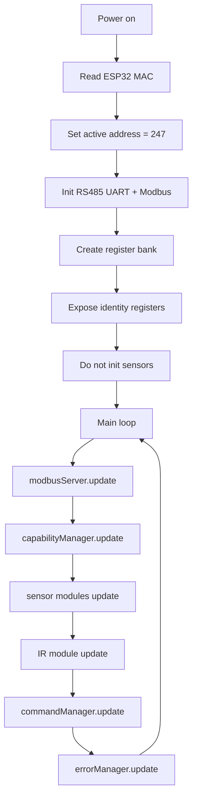
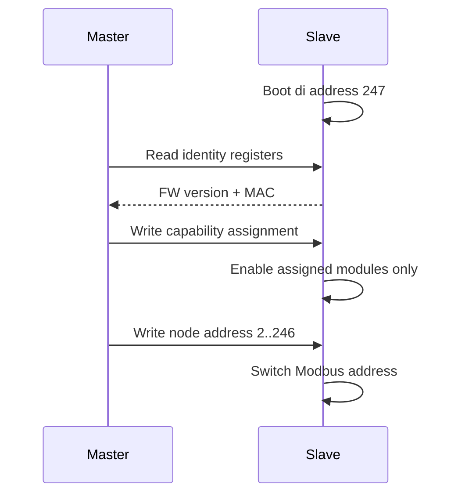
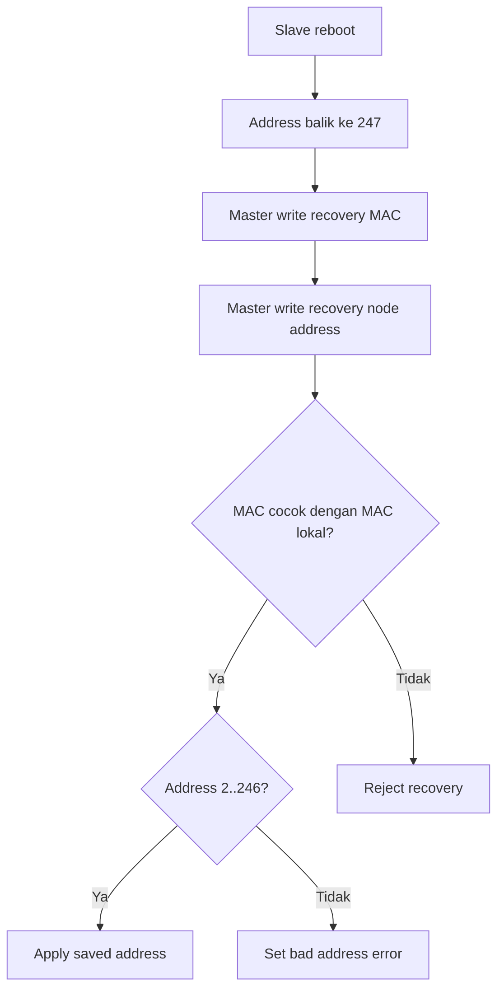
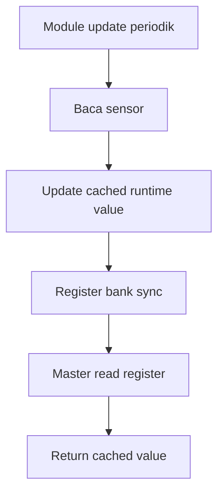
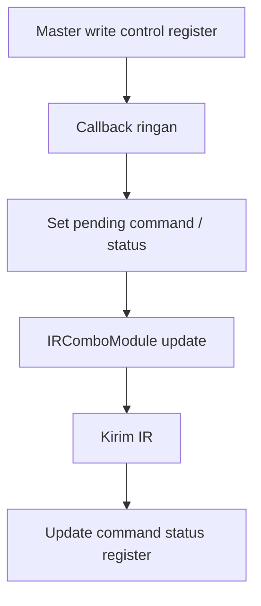

# HK Slave V1

Firmware ini adalah node slave RS485 Modbus RTU untuk sistem Smart Building. Target board saat ini adalah ESP32-C3 dengan Arduino framework di PlatformIO.

Inti desainnya sederhana: master adalah otak sistem, slave adalah endpoint yang stabil. Slave tidak menyimpan mapping ruangan, nama device, profile final, atau aturan apakah kombinasi sensor tertentu legal. Slave hanya menerima assignment dari master, mengaktifkan module yang diminta, membaca sensor secara periodik, lalu menyajikan hasilnya lewat register Modbus.

## Gambaran Singkat

Slave ini bisa menangani beberapa capability:

| Capability | Hardware | Cara kerja |
| --- | --- | --- |
| Temperature | DHT22 | Sampai 4 channel di GPIO universal |
| Lux | BH1750 | I2C, address 0x23 dan 0x5C |
| CO2 | SCD30 | I2C, address default 0x61 |
| Presence | LD2410 digital output | Sampai 4 input digital |
| Relay | Relay lampu digital output | Relay 1 di GPIO 0, Relay 2 di GPIO 1 |
| IR AC | Panasonic DKE via IR | AC 1 di GPIO 0, AC 2 di GPIO 1 |
| IR Projector | EPSON HD03/HD04 via NEC IR | GPIO 3 dan GPIO 4 |

Yang penting: sensor dan actuator tidak langsung aktif saat boot. Semua menunggu assignment dari master.

## Cara Berpikir Project Ini

Slave ini dibuat **policy-blind**.

Artinya:

- Slave tidak tahu ruangan mana yang dipasang.
- Slave tidak tahu nama device.
- Slave tidak tahu profile final seperti `TEMP_NODE`, `CO2_NODE`, atau `IR_COMBO_NODE`.
- Slave tidak memutuskan kombinasi capability mana yang boleh atau tidak boleh.
- Slave tidak menyimpan address atau assignment ke EEPROM/NVS.

Master yang menentukan semuanya. Slave hanya menjalankan register contract dan runtime state.

Setiap boot, slave mulai dari address pairing:

```text
247
```

Master membaca identity, menulis assignment, lalu memberi address final. Karena state masih RAM-only, setelah reboot slave balik lagi ke address 247 dan master perlu melakukan recovery atau assignment ulang.

## Hardware

| Fungsi | Pin |
| --- | --- |
| I2C SDA | GPIO 8 |
| I2C SCL | GPIO 7 |
| RS485 DIR / DE+RE | GPIO 2 |
| RS485 RX | GPIO 20 |
| RS485 TX | GPIO 21 |
| Universal port 0 | GPIO 0 |
| Universal port 1 | GPIO 1 |
| Universal port 3 | GPIO 3 |
| Universal port 4 | GPIO 4 |

RS485 memakai transceiver MAX3485 atau compatible 3.3V. `PIN_RS485_DIR` mengontrol arah half-duplex:

```text
LOW  = receive
HIGH = transmit
```

## Pin Profile

GPIO `0/1/3/4` adalah port universal. Pin yang sama bisa dipakai untuk profile berbeda, tetapi tidak semua profile seharusnya aktif bersamaan. Konflik dicegah oleh master lewat assignment/profile policy.

| Profile | GPIO 0 | GPIO 1 | GPIO 3 | GPIO 4 |
| --- | --- | --- | --- | --- |
| DHT22 | Temp 1 | Temp 2 | Temp 3 | Temp 4 |
| Presence | Presence 1 | Presence 2 | Presence 3 | Presence 4 |
| Relay | Relay 1 | Relay 2 | - | - |
| IR Combo | AC 1 IR | AC 2 IR | Projector IR A | Projector IR B |

SCD30 dan BH1750 memakai I2C di GPIO 8/7.

## Arsitektur Firmware



Layer penting:

- `src/modbus`: Modbus RTU server, register bank, dan write callback.
- `src/core`: runtime state, capability manager, command manager, error manager.
- `src/modules`: logic sensor/actuator per capability.
- `src/drivers`: wrapper library hardware.
- `src/config`: pin, build config, dan register map.

## Flow Utama Runtime



Loop harus sering berputar. Tidak ada `delay()` di production loop. Modbus callback tidak membaca sensor dan tidak mengirim IR langsung.

## Pairing Flow



Address valid adalah `2..246`. Jika master menulis address di luar range itu, firmware menolak dan mengisi `last_error`.

## Recovery Flow

Saat reboot, slave selalu kembali ke 247. Master bisa recovery dengan menulis MAC target dan saved address ke recovery registers.



Catatan implementasi saat ini: non-matching slave mengabaikan recovery request dan
tetap berada di address `247`. Pada bus yang berisi banyak slave di address 247,
master tetap perlu siap menghadapi collision/response error saat proses recovery.

## Register Mirror

Register bukan tempat logic utama. Register hanya mirror dari state firmware.

Sensor read:



Actuator write:



## Blok If / Else

### Boot

```text
if power_on:
    read MAC
    active_address = 247
    expose identity registers
    do not init sensors
    wait for master assignment
```

### Master Write Capability

```text
if capability register changed:
    save assignment to RAM

    if related module assigned:
        enable module
        if module not initialized:
            module.begin()
    else:
        keep module disabled
        return not-assigned sentinel on reads
```

### Master Write Address

```text
if new_address >= 2 and new_address <= 246:
    active_address = new_address
    switch Modbus slave address
else:
    reject value
    set last_error = bad address
```

### Master Read Sensor

```text
if sensor not assigned:
    return NOT_ASSIGNED sentinel
else if sensor assigned but read error:
    return ERROR sentinel
else:
    return cached value
```

### Master Write IR Command

```text
if IR module not assigned:
    reject command
else if selected IR channel not enabled:
    reject command
else if IR module busy:
    set command status = busy
else:
    store pending command
    set command status = busy
```

### IR Update

```text
if command_pending:
    mark busy
    send IR command

    if send ok:
        command_status = success
    else:
        command_status = failed

    start cooldown
```

## Register Penting

### Identity

| Register | Nama |
| --- | --- |
| `0x0000` | Node address |
| `0x0001` | Firmware version |
| `0x0002` | MAC byte 0-1 |
| `0x0003` | MAC byte 2-3 |
| `0x0004` | MAC byte 4-5 |

### Assignment

| Register | Nama |
| --- | --- |
| `0x0010` | Temp assignment mask |
| `0x0011` | Lux assignment mask |
| `0x0012` | CO2 count |
| `0x0013` | Presence assignment mask |
| `0x0014` | Relay assignment mask |
| `0x0015` | IR projector enable |
| `0x0016` | IR AC 1 enable |
| `0x0017` | IR AC 2 enable |

Assignment mask memakai 4 bit untuk channel. Implementasi saat ini memetakan bit seperti ini:

```text
bit 3 -> channel 1
bit 2 -> channel 2
bit 1 -> channel 3
bit 0 -> channel 4
```

Contoh:

```text
0b1000 = channel 1 aktif
0b1100 = channel 1 dan 2 aktif
0b1111 = semua channel aktif
```

### Sensor

| Register | Nama |
| --- | --- |
| `0x0100..0x0103` | Temperature 1-4, format x10 |
| `0x0104..0x0107` | Lux 1-4, lux integer |
| `0x0108` | CO2 PPM |
| `0x0109..0x010C` | Presence 1-4 |
| `0x010D..0x010E` | Relay 1-2 |

### IR Control

| Register | Nama |
| --- | --- |
| `0x0200` | AC 1 power |
| `0x0201` | AC 1 set temp x10 |
| `0x0202` | AC 1 mode |
| `0x0203` | AC 2 power |
| `0x0204` | AC 2 set temp x10 |
| `0x0205` | AC 2 mode |
| `0x0206` | AC 1 command status |
| `0x0207` | AC 2 command status |
| `0x0208` | AC 1 fan speed |
| `0x0209` | AC 1 swing vertical |
| `0x020A` | AC 1 swing horizontal |
| `0x020B` | AC 2 fan speed |
| `0x020C` | AC 2 swing vertical |
| `0x020D` | AC 2 swing horizontal |
| `0x0210` | Projector power |
| `0x0211` | Projector input |
| `0x0212` | Projector command status |

Command status:

| Nilai | Arti |
| --- | --- |
| `0` | Idle |
| `1` | Success |
| `2` | Busy |
| `3` | Failed |

Untuk IR, `success` hanya berarti firmware berhasil mengirim sinyal IR. Itu bukan bukti AC atau projector benar-benar berubah state, karena IR bersifat one-way.

## Alert dan Status Error

Alert utama slave tersedia melalui holding/input register `LAST_ERROR` di
`0x00F1`. Nilai ini bersifat sticky: error pertama dipertahankan sampai master
menulis `0` ke `LAST_ERROR`, atau sampai firmware reboot. Jika penyebab error
module masih aktif, `ErrorManager` dapat mengisi error yang sama lagi setelah clear.

| Nilai | Nama | Status runtime saat ini | Pemicu |
| --- | --- | --- | --- |
| `0` | `SLAVE_ERR_NONE` | Aktif | Tidak ada error / clear error |
| `1` | `SLAVE_ERR_SENSOR_TIMEOUT` | Aktif | DHT22, BH1750, SCD30, atau presence gagal membaca data |
| `2` | `SLAVE_ERR_SENSOR_CRC` | Disiapkan | Belum dipicu oleh module saat ini |
| `3` | `SLAVE_ERR_SENSOR_RANGE` | Disiapkan | Belum dipicu oleh module saat ini |
| `4` | `SLAVE_ERR_CONFIG_RUNTIME` | Aktif | Relay belum assigned, module relay gagal apply state, atau config runtime gagal |
| `5` | `SLAVE_ERR_BAD_ADDRESS` | Aktif | Master menulis node/recovery address di luar `2..246` |
| `6` | `SLAVE_ERR_UNSUPPORTED_WRITE` | Aktif | Value/register write tidak didukung atau tidak valid |
| `7` | `SLAVE_ERR_BUSY` | Disiapkan | Busy saat ini dilaporkan lewat command status, belum lewat `LAST_ERROR` |
| `8` | `SLAVE_ERR_RECOVERY_MAC` | Disiapkan | Recovery MAC mismatch saat ini diabaikan sesuai contract |
| `9` | `SLAVE_ERR_IR_COMMAND_FAILED` | Aktif | Pengiriman IR AC/projector gagal |

Status command IR terpisah dari `LAST_ERROR`:

| Register | Device |
| --- | --- |
| `0x0206` | AC 1 command status |
| `0x0207` | AC 2 command status |
| `0x0212` | Projector command status |

Command status memakai `0=idle`, `1=success`, `2=busy`, dan `3=failed`.

## Sentinel Value

| Kondisi | Value |
| --- | --- |
| Temperature not assigned | `-32767` |
| Temperature error | `-32768` |
| Unsigned sensor not assigned | `0xFFFE` |
| Unsigned sensor error | `0xFFFF` |

Unsigned sensor meliputi lux, CO2, presence, dan relay state.

## Cara Kerja Module

### DHT22 Temperature

- Pin: GPIO `0/1/3/4`.
- Bisa sampai 4 channel.
- Update minimal setiap 2000 ms.
- Hanya expose temperature x10.
- Humidity belum dipakai.
- Jika gagal baca, register channel menjadi `-32768`.

### BH1750 Lux

- Bus: I2C SDA GPIO 8, SCL GPIO 7.
- Speed: 100 kHz.
- Driver saat ini support address `0x23` dan `0x5C`.
- Channel 3 dan 4 ada di register, tetapi belum support secara fisik tanpa I2C mux atau strategi address tambahan.
- Update sekitar 1000 ms.

### SCD30 CO2

- Bus: I2C SDA GPIO 8, SCL GPIO 7.
- Speed: 100 kHz.
- Data utama: CO2 PPM.
- Update sekitar 2000 ms dan mengikuti `dataAvailable()`.
- Jika sensor tidak terpasang saat assigned, value menjadi `0xFFFF`, bukan angka palsu seperti 400 ppm.

### Presence Digital

- Pin: GPIO `0/1/3/4`.
- Input digital dari LD2410.
- `LOW = no presence`.
- `HIGH = presence detected`.
- Ada debounce/stable time 500 ms sebelum cached state berubah.

### Relay Lampu

- Relay 1 output: GPIO 0.
- Relay 2 output: GPIO 1.
- Relay aktif hanya setelah `RELAY_ASSIGNMENT` dari master.
- Output diasumsikan active HIGH: `0 = off`, `1 = on`.
- Write ke `0x010D` mengontrol relay 1, write ke `0x010E` mengontrol relay 2.

### IR Combo

- Library IR: `IRremoteESP8266` by David Conran.
- AC memakai `IRPanasonicAc` dengan model `kPanasonicDke`.
- Power `0/1` mengirim state OFF/ON diskret, bukan toggle.
- Set temperature menerima `160..300` dalam Celsius x10, dengan langkah 10 atau 1°C.
- Mode slave: `0=cool`, `1=dry`, `2=fan`, `3=heat`, `4=auto`.
- Fan speed: `0=auto`, `1=low`, `2=medium`, `3=high`, `4=quiet`, `5=powerful`, `99=no change`.
- Swing vertical: `0=fixed/middle`, `1=auto`, `2..6=up..down`, `7=step next`, `8=step previous`, `9/10=safe no-op`, `99=no change`.
- Swing horizontal: `0=middle`, `1=auto`, `2..6=left..right`, `7=step next`, `8=step previous`, `9/10=safe no-op`, `99=no change`.
- Setiap write power, temperature, mode, fan, atau swing mengirim full-state Panasonic DKE terbaru.
- AC 1 output: GPIO 0.
- AC 2 output: GPIO 1.
- Projector output: GPIO 3 dan GPIO 4.
- Driver IR hanya menginisialisasi output yang assigned; projector tidak menyentuh GPIO relay/AC 0 dan 1.
- Projector EPSON memakai sequence NEC `0x81C00FF0` lalu `0xC1AA09F6`.
- Sequence dikirim dua kali ke kedua output projector dengan jeda non-blocking 40 ms antar kode.
- `PROJECTOR_POWER` menjadi trigger power toggle karena sequence ON/OFF yang tersedia sama.
- `PROJECTOR_INPUT` ditolak sampai tersedia kode input EPSON yang sudah divalidasi.
- Command memakai single command slot.
- Jika sedang busy, command baru ditolak dengan status `busy`.
- Setelah kirim IR, module cooldown sekitar 1000 ms.

## Yang Sudah Ada

- Struktur project sudah dipisah menjadi config, core, modbus, modules, dan drivers.
- Boot identity memakai MAC ESP32.
- Default address 247.
- Register map utama sudah ada.
- Assignment runtime sudah ada.
- Sensor menggunakan cached read.
- Modbus register sync dilakukan dari `RegisterBank::update()`.
- IR command tidak dikirim langsung dari callback, tetapi diambil oleh `IRComboModule::update()`.
- Recovery MAC compare sudah ada.
- Presence debounce sudah ada.
- Error sentinel dan not-assigned sentinel sudah dipakai.
- Relay 1 dan Relay 2 sudah memakai driver digital output active HIGH.
- Inisialisasi IR sudah dipisahkan per channel supaya assignment projector tidak
  mengubah GPIO 0/1 yang sedang dipakai relay.
- Firmware terbaru berhasil dibuild dan diflash ke ESP32-C3 melalui COM3 pada
  6 Juni 2026.

## Yang Masih Kurang / Perlu Dibereskan

- Relay perlu diuji end-to-end menggunakan beban/relay module target setelah
  master mengirim assignment dan perintah ON/OFF.
- Lux channel 3 dan 4 belum benar-benar bisa dipakai tanpa I2C mux atau hardware address tambahan.
- Panasonic DKE tetap perlu diuji langsung ke unit AC target.
- Behavior final saat IR command ditulis ketika module belum assigned perlu diputuskan sesuai contract.
- Firmware version di `BuildConfig.h` adalah `1.0.0`, tetapi runtime/register memakai nilai `210` untuk contract/config v2.1.0. Ini perlu dirapikan supaya tidak membingungkan.
- Assignment dan address belum persistent. Ini memang sesuai FSD V1, tapi berarti master wajib handle pairing/recovery setelah reboot.
- Tidak ada test otomatis untuk register callback, sentinel value, recovery flow, dan busy command flow.
- Recovery di address 247 masih punya risiko collision jika banyak slave baru boot bersamaan.

## Build dan Upload

Install dependency lewat PlatformIO, lalu build:

```bash
pio run
```

Upload:

```bash
pio run --target upload
```

Monitor serial debug:

```bash
pio device monitor
```

Environment PlatformIO:

```ini
[env:lolin_c3_mini]
platform = espressif32
board = lolin_c3_mini
framework = arduino
monitor_speed = 115200
```

Modbus RTU:

```text
Baudrate: 19200
Format: 8N1
Default slave address: 247
```

## Verifikasi Relay

Relay tidak aktif hanya karena firmware selesai boot. Master harus lebih dulu
menulis `RELAY_ASSIGNMENT`, kemudian menulis state relay.

> [!WARNING]
> Relay lampu dan IR AC memakai pin fisik yang sama: Relay 1/AC 1 di GPIO 0,
> Relay 2/AC 2 di GPIO 1. Master tidak boleh mengaktifkan relay dan IR AC pada
> channel yang sama. Assignment konflik atau inisialisasi IR yang salah dapat
> mengubah output relay dan membuat lampu mati/berubah state tanpa perintah relay.

```text
RELAY_ASSIGNMENT bit 1 / value 2 = Relay 1 di GPIO 0
RELAY_ASSIGNMENT bit 0 / value 1 = Relay 2 di GPIO 1

Write 0x010D = 1 -> GPIO 0 HIGH
Write 0x010D = 0 -> GPIO 0 LOW
Write 0x010E = 1 -> GPIO 1 HIGH
Write 0x010E = 0 -> GPIO 1 LOW
```

GPIO 0/1 dipakai bersama oleh profile Relay dan IR AC. Master wajib mencegah
assignment yang konflik. Di sisi slave, IR hanya melakukan `begin()` pada
channel IR yang benar-benar assigned sehingga projector-only tidak lagi
menimpa output relay menjadi LOW.

## Dokumen Utama

FSD lengkap ada di:

```text
docs/hk_slave_fsd_v_1.md
```

Jika ada konflik antara README ini, FSD, dan contract Modbus v2.2.0-draft, urutan prioritasnya:

```text
Contract Modbus v2.2.0-draft > FSD > README
```
