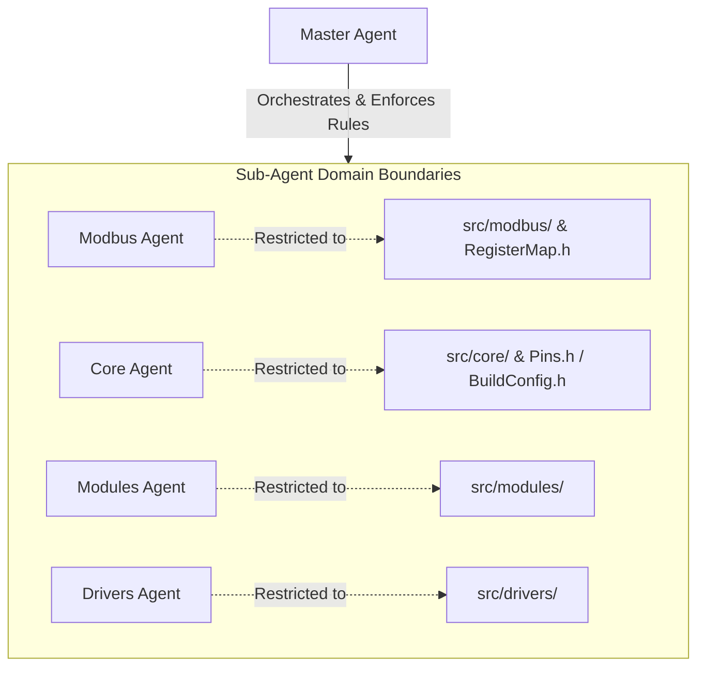

# Master Agent Documentation

This document defines the agentic orchestration architecture for developing the **ESP32-C3 RS485 Modbus Slave (HK_Slave_V1)**. It divides responsibilities into four dedicated sub-agents to enforce safety, modularity, and strict domain boundaries.

---

## 1. Sub-Agent Job Matrix

Below is the listing of jobs assigned to each sub-agent. The Master Agent coordinates execution and ensures sub-agents operate strictly within their boundaries.

| Sub-Agent | Core Responsibility | Primary Files / Folders | Key Deliverables & Job Scope |
| :--- | :--- | :--- | :--- |
| **Modbus Sub-Agent** | RS485 & Modbus RTU Server Layer | `src/modbus/` `src/config/RegisterMap.h` | <ul><li>Initialize Modbus RTU server on hardware UART.</li><li>Implement the register map mapping registers to cache slots.</li><li>Write lightweight register callbacks for read/write.</li><li>Maintain register mirror synchronization.</li></ul> |
| **Core Sub-Agent** | Runtime State & Cooperative Scheduler | `src/core/` `src/config/Pins.h` `src/config/BuildConfig.h` | <ul><li>Implement system boot sequence and address management (pairing/recovery).</li><li>Create a `millis()`-based cooperative scheduler.</li><li>Develop `CapabilityManager`, `CommandManager`, `ErrorManager`.</li><li>Handle MAC address pairing matching and address shifting.</li></ul> |
| **Modules Sub-Agent** | Non-blocking Module Controller Layer | `src/modules/` | <ul><li>Implement uniform module interfaces (`begin`, `update`, `isEnabled`, `isBusy`).</li><li>Maintain cached sensor values and internal module states.</li><li>Handle non-blocking scheduling of reads/writes via scheduler callbacks.</li><li>Implement command slots and busy indicators (e.g. for IR).</li></ul> |
| **Drivers Sub-Agent** | Hardware Driver Wrapper Layer | `src/drivers/` | <ul><li>Wrap third-party libraries (BH1750, SCD30, DHT22, IRremoteESP8266).</li><li>Provide unified, simplified hardware drivers.</li><li>Isolate physical layer complexities (I2C 100 kHz bus, GPIO setup, IR packet structures).</li></ul> |

---

## 2. Strict Domain Access Boundaries

To prevent cross-contamination, sub-agents are strictly forbidden from opening or writing to files outside their designated paths.

### Access Policy

1. **Modbus Sub-Agent**
   - **Allowed Paths**: `src/modbus/` (all files), `src/config/RegisterMap.h`
   - **Read-Only Paths**: `src/config/Pins.h`, `src/config/BuildConfig.h`
   - **Forbidden Paths**: `src/core/`, `src/modules/`, `src/drivers/`

2. **Core Sub-Agent**
   - **Allowed Paths**: `src/core/` (all files), `src/config/Pins.h`, `src/config/BuildConfig.h`
   - **Read-Only Paths**: `src/config/RegisterMap.h`
   - **Forbidden Paths**: `src/modbus/`, `src/modules/`, `src/drivers/`

3. **Modules Sub-Agent**
   - **Allowed Paths**: `src/modules/` (all files)
   - **Read-Only Paths**: `src/core/` (interfaces/headers only), `src/config/` (all headers), `src/drivers/` (driver interfaces/headers only)
   - **Forbidden Paths**: `src/modbus/`, `src/drivers/` (implementation source files)

4. **Drivers Sub-Agent**
   - **Allowed Paths**: `src/drivers/` (all files)
   - **Read-Only Paths**: `src/config/` (all headers)
   - **Forbidden Paths**: `src/modbus/`, `src/core/`, `src/modules/`

---

## 3. Core Architectural Rules

Every sub-agent must adhere to the following rules, with zero exceptions:

> [!WARNING]
> **No Blocking Operations**: Under no circumstances should `delay()` be used in the loop or in callbacks. All timing must rely on the `millis()` scheduler.

> [!IMPORTANT]
> **Lightweight Callbacks**: Modbus callbacks must be extremely fast. They are only allowed to modify command state variables or queue command slots. They must never directly communicate with hardware sensors or transmit IR signals.

> [!NOTE]
> **Lazy Hardware Initialization**: Universal GPIOs `0/1/3/4` and sensors must not be initialized at boot time. They are only initialized (`begin()`) when a corresponding assignment is written by the Master Modbus controller.

---

## 4. Testing & Uploading Policy

> [!CAUTION]
